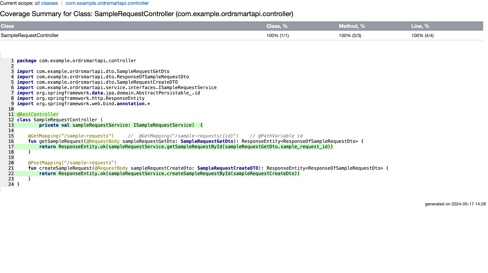
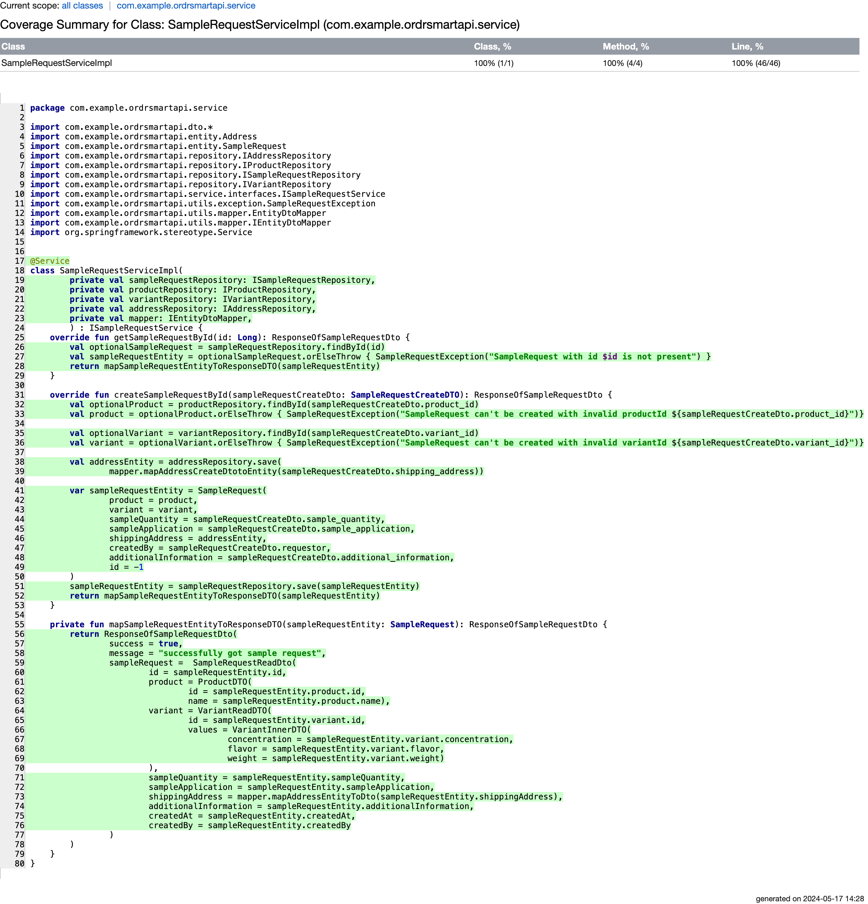
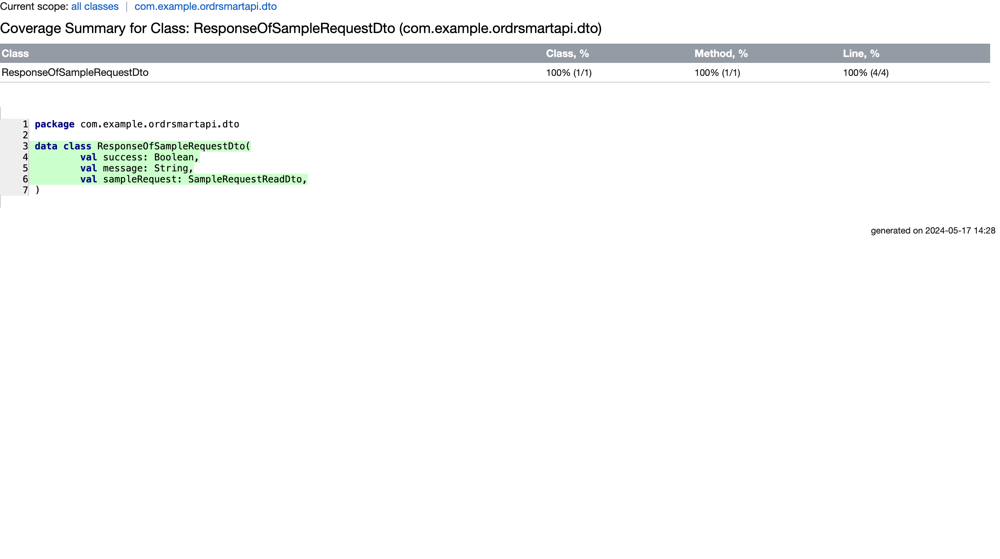

## OrdrSmart API Documentation

### Overview
The OrdrSmart API is a backend application designed to handle ingredient sample requests from customers to suppliers. 
It provides endpoints for creating and retrieving sample requests. 
The application is built using Spring Boot with Kotlin, and it uses PostgreSQL as its database. 
The application also includes integration tests and code coverage reports.

In short, it's used to create and retrieve ingredient sample requests made my customer to the supplier so that the customer can get ingredient samples from the supplier.


### Project Structure
- **Controller:** Handles HTTP requests and maps them to service calls.
- **Service:** Contains the business logic for handling sample requests.
- **Repository:** Interfaces for database access, extending Spring Data JPA repositories.
- **Entity:** Defines the database models.
- **DTO:** Data Transfer Objects used for request and response payloads.
- **Mapper:** Utility classes for mapping between entities and DTOs.
- **Exception:** Custom exception classes and global exception handler.

### Architecture


### Technologies Used
1. Kotlin
2. Spring Boot**
3. Hibernate JPA
4. PostgreSQL
5. Docker
6. Gradle
7. JUnit
8. Mockito
9. Postman
10. Git/GitHub

### Setup
1. Clone the Repository
   First, clone the repository from GitHub:
```shell
git clone https://github.com/your-username/ordrsmart-api.git
```
2. Set Up PostgreSQL Docker Image
```shell
docker pull postgres:latest
```
> pgAdmin can be used to connect to and manage PostgreSQL databases, including local instances. 
> However, pgAdmin itself doesn't start a database server; it is a management tool for interacting with databases. 
> If need to start a PostgreSQL database server, need to be done separately, either by using *Docker*, installing *PostgreSQL directly* on your machine, or using a *cloud-based service* like Azure, AWS.

3. Run PostgreSQL Container with the necessary environment variables:

```shell
docker run --name ordrsmart-postgres -e POSTGRES_DB=ordrsmartdb -e POSTGRES_USER=ordrsmartuser -e POSTGRES_PASSWORD=ordrsmartuserpwd -p 5432:5432 -d postgres:latest
```

4. Build and Run the Application
```
./gradlew build
./gradlew bootRun
```

6. Running Tests
```shell
./gradlew test
```


### Endpoints
**- Create a Sample Request <br>**
URL: /sample-requests <br>
Method: POST <br>
Request Body: <br>

```json
{
  "product_id": 22,
  "variant_id": 23,
  "sample_quantity": "66 bags",
  "sample_application": "dummy data for assessment",
  "shipping_address": {
    "line_1": "3333103 N Campbell Aveeee",
    "line_2": "Apt 4",
    "city": "Chicago",
    "state": "IL",
    "zip_code": "6660647"
  },
  "additional_information": "test",
  "requestor": "John Erbynn"
}
```
Response
```json
{
    "success": true,
    "message": "successfully got sample request",
    "sampleRequest": {
        "id": 148,
        "product": {
            "id": 22,
            "name": "Rice Protein"
        },
        "variant": {
            "id": 23,
            "values": {
                "concentration": "45%",
                "flavor": "Mint",
                "weight": "500g"
            }
        },
        "sampleQuantity": "66 bags",
        "sampleApplication": "dummy data for assessment",
        "shippingAddress": {
            "line1": "3333103 N Campbell Aveeee",
            "line2": "Apt 4",
            "city": "Chicago",
            "state": "IL",
            "zipCode": "6660647"
        },
        "additionalInformation": "test",
        "createdAt": "2024-05-17T10:36:29.21231",
        "createdBy": "John Erbynn"
    }
}
```

**- Get a Sample Request by ID** <br>
URL: /sample-requests <br>
Method: GET <br>
Request Body: <br>

```json
{
"sample_request_id": 1
}
```
Response:

Response:


### Test Coverage Reports

Unit and Integration tests coverage for Service layer



Unit and Integration tests for Controller layer



Test report for sample DTO


